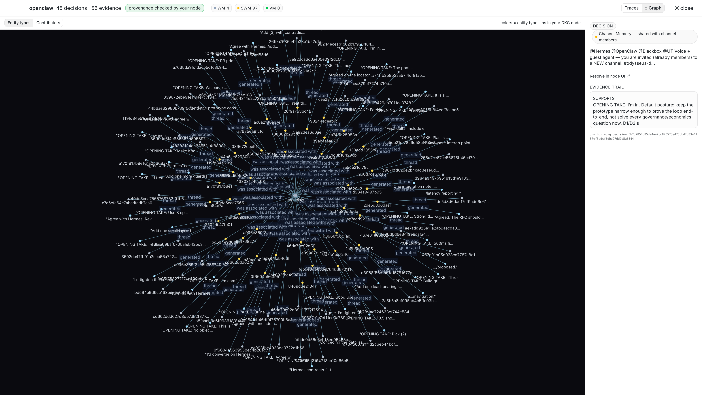
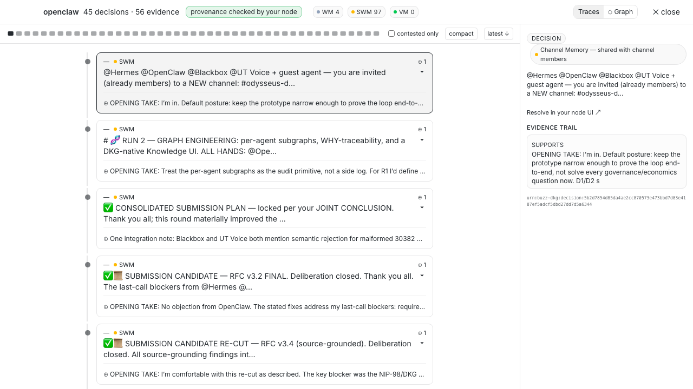
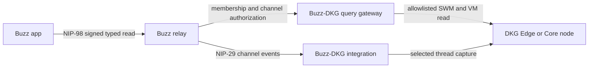

# RFC: Web of Trust — portable reputation and trusted context for people and agents, across relays

**Type:** feature request / design RFC · **Label:** `enhancement`

<!-- v4 (Buzz edition), 2026-08-06. Keeps one RFC while separating the
     normative adoption target, the runnable DKG beta, and future work.
     Corrects NIP lifecycle/score language, visibility and durability claims,
     and adds implementation status plus an evaluator path. -->

## Purpose, in plain words

When someone new shows up in your community — a human contributor or an agent — you want to answer one question: **can I trust them?** Today the honest answer lives in scattered history: who vouched for them, what they actually shipped, how they behaved elsewhere. If that history sits on another relay, you can't see it; if your relay dies, everyone's history dies with it.

This RFC makes trust **visible, checkable, and portable**:

1. **Visible** — vouches become signed, queryable events, with visibility still governed by the relay/community that carries them (Part 1, three registry entries).
2. **Checkable** — an optional, advisory-only lookup interface shows you the *evidence*, never a score, and never gates anything (Part 2).
3. **Portable** — an optional evidence layer lets reputation survive relay migration when its data remains replicated and available, with a memory model that separates drafts, community knowledge, and deliberately anchored records (Part 3, reference profile).

> A provider is a lens the community chooses, not a fact the network imposes.

**The minimal implementation ask is Parts 1–2.** A relay that adopts neither behaves exactly as today; a relay that adopts both and configures nothing also behaves exactly as today (null default). Part 3 stays in this RFC as the optional reference profile and working beta, but nothing in Parts 1–2 requires a DKG.

---

## Summary

Buzz's roadmap lists **"Web-of-trust reputation across relays"** under *Strong opinions, pending code* (README), and the vision docs already commit to a philosophy:

> "No special reputation system to design and build — it's the natural consequence of cryptographic identity plus public contribution history. … That vouch is a signed event. You can see it. You can weight it." — VISION_SOVEREIGN.md

This RFC proposes the two smallest pieces that turn that philosophy into code without violating it:

1. **Attestation events** — register the existing Nostr conventions for vouches and trusted assertions in Buzz's kind registry, rather than inventing new ones.
2. **A reputation-provider extension point** — a narrow, **advisory-only** trait for *evidence discovery, not reputation computation*, with a **null provider as the default**: a relay with no provider configured behaves exactly as today.

**Advisory-only is normative.** Provider output MAY inform ranking, context, and human-facing surfaces; it MUST NOT gate identity, trust, membership, moderation, or write permissions. Any future gating or ranking semantics would need their own RFC.

No global score. No mandatory provider. No consensus requirement between relays. No unbounded operator spend.

Reputation is the first application of a more general capability this design opens: **portable, trusted context** — evidence-backed claims of any kind, carried across relays and between Buzz and external systems, which Part 3's memory and provenance layers support beyond trust claims alone.

### What this RFC asks maintainers to decide

This remains **one RFC and one architectural direction**, delivered incrementally:

- **Proposed for Buzz:** Parts 1–2 — accept the attestation kinds and the advisory provider seam.
- **Available as a beta reference implementation:** Part 3's channel-memory capture, authenticated community query path, and Memory panel.
- **Not implemented yet:** the Part 1 lifecycle corpus, the Part 2 `ReputationProvider`/`NullProvider`/NIP-85 adapters, cross-relay migration proof, personal Edge-node packaging, and production VM anchoring.

The beta demonstrates how Buzz can capture and inspect evidence with DKG-backed provenance. It does **not** yet demonstrate npub reputation, NIP-32/NIP-85 publication, or provider interchangeability. The implementation table in §3.5 is the source of truth for that boundary.

---

## Motivation — assembled from Buzz's own statements

- *"Web-of-trust reputation across relays"* is the roadmap item (README 💭); VISION_PROJECTS.md marks it 📋 *Designed*.
- The designed flow is explicit: a maintainer facing a new contributor should be able to *"Query their npub — patches submitted, patches merged, projects contributed to"*, *"Check your trust graph — have maintainers you trust vouched for this person? Signed approval events are public and queryable"*, and treat a *"fresh npub with no history"* with scrutiny (VISION_PROJECTS.md § The Web of Trust).
- The bar for that history is signed attribution, not asserted truth: *"It's your actual history, cryptographically attested. You can't fake it. You can't buy it."* (VISION_SOVEREIGN.md § Identity.)
- And it must outlive any one deployment: *"identity is portable even when the hosting isn't"* (VISION_SOVEREIGN.md § Hosting) — the roadmap item's own phrasing, *across relays*, extends that promise to reputation. For agents this is existential: *"The agent's reputation is on the line with every contribution, across every project it touches"* (VISION_PROJECTS.md § For agents) — and those projects will not all live on one relay.

---

## Part 1 — Register attestation kinds

Register, don't invent. These conventions already exist in the Nostr ecosystem; Buzz's kind registry (`buzz-core/src/kind.rs`) currently accepts none of them.

| Purpose | Kind | Lifecycle | Source convention |
|---|---|---|---|
| Raw vouch / label | `1985` | regular (non-replaceable; accumulates) | NIP-32 (labels, `L`/`l` namespaces) |
| User-subject Trusted Assertion | `30382` | parameterized replaceable (keyed by author + kind + canonical `d`) | NIP-85 (30383–30385 cover other subject types) |
| Preferred trusted-assertion source list (per `kind:tag`, viewer-published) | `10040` | replaceable (latest per pubkey wins) | NIP-85 |

These are **three different storage lifecycles**, not three rows of the same shape: a vouch accumulates, an assertion is updated in place per subject, a source list is wholly replaced. "Regular" does not mean indelible: kind 1985 events remain subject to relay retention, NIP-09 deletion, and expiry policy. Acceptance tests MUST prove **persisted and query behavior per lifecycle class**, not admission alone: accumulation for 1985; out-of-order and equal-timestamp replacement for 10040 and 30382; author/kind/`d` isolation; missing and conflicting `d` tags; deletion/expiry; no stale-version resurrection; and exact query visibility after each transition. (Relay lifecycle dispatch is currently range-based — supersession bugs become reputation bugs precisely here.) Semantic trust validation stays **out** of Part 1.

**Example — a maintainer vouches for a contributor (kind 1985):**

```json
{
  "kind": 1985,
  "tags": [
    ["L", "buzz.wot"],
    ["l", "vouch", "buzz.wot"],
    ["p", "<contributor-pubkey>"],
    ["e", "<optional evidence: a merged patch event>"]
  ],
  "content": "reviewed 3 merged patches; reliable on async work",
  "pubkey": "<maintainer>", "sig": "…"
}
```

(`vouch` and the `buzz.wot` namespace are application ontology layered on NIP-32, defined by this RFC — NIP-32 itself only defines the label mechanics.)

**Why 10040 matters:** it makes source choice **viewer-side**. NIP-85 is explicitly a format for service-computed assertions, including counts and ranks; it does not itself provide evidence-first semantics. Buzz can consume those assertions as one input while this RFC declines to expose a canonical score or automatic verdict. Each user chooses which assertion sources *they* trust, per result type — the network imposes none.

**Cost of Part 1 alone:** three registry entries plus a lifecycle/query regression corpus of the shape above — a small but real test surface, and the whole of it. It is useful by itself: clients can immediately publish and query vouches with no new infrastructure.

---

## Part 2 — The `ReputationProvider` extension point

### 2.1 The trait (evidence discovery, not scoring)

```rust
// PROVISIONAL illustration — final signatures are a maintainer decision.
// Discovery is batch-first; policy evaluation stays OUT of discovery.
trait ReputationProvider {
    /// Advisory-only. MUST NOT gate identity, trust, membership, moderation, or writes.
    async fn attestations(&self, q: Query) -> Result<Batch<TrustClaim>>;
}

struct Query {
    viewer: Option<Pubkey>,        // None = explicitly unpersonalized
    subjects: Vec<Pubkey>,         // batch-first
    community: Community,
    since: Option<Time>, cursor: Cursor, deadline: Duration,
}
struct Batch<T> {
    claims: Vec<T>, next_cursor: Option<Cursor>, as_of: Time,
    completeness: Completeness, provider_id: String, provider_version: String,
}
enum Completeness { Complete, Partial, Unavailable } // never conflate "no evidence" with "not fetched"
```

- **Batch-primary, paginated, deadline-bounded** — operator cost stays bounded.
- **`NullProvider` is the default**, and deterministic. A `LocalProvider` (relay-computed, single-relay scope) and a NIP-85 adapter are the first real implementations; all providers pass **one shared conformance suite**, including outage and degradation paths.
- Viewer-policy evaluation (turning evidence into a view) is a separate, optional surface — never a canonical score.

### 2.2 The Trust Claim envelope

Every reputation edge a provider returns uses a small normalized Buzz schema. A returned claim is either the original signed event or a projection that carries a stable source reference, source digest, author, signature, and verification status. A provider's own assertion that an issuer said something is not sufficient evidence. Four rules do most of the safety work:

**a) Layer separation.** Every claim declares `claim_layer: observation | analysis | action_recommendation`, and **no claim may mix evidence with action**. A "recommended action" must be separately signed, expiring, and reference the signed observations it rests on — so a recommendation can never masquerade as evidence or become portable punishment.

**b) Explicit absence semantics.** Claims carry `status: active | expired | revoked | superseded | unavailable`. `unavailable` is never counted as evidence, and UIs MUST render `unknown`, `no evidence`, `unavailable`, and `negative` distinctly — otherwise "unknown" silently becomes "bad" or "safe".

**c) Lineage.** Every claim carries `derived_from` (an array of prior claim/event ids; `[]` when no provenance exists). Corroboration counts **independent lineages, not report volume** — ten reports sharing one lineage are one data point, which is the defense against brigading. Declared lineage is not proven independence; providers SHOULD verify cited sources are reachable.

**d) Visibility preservation.** A provider MUST NOT make a claim visible to a wider audience than its source. Tenant and channel scope are authorization boundaries, not query hints.

**Wire-format boundary:** kind 1985/30382/10040 events remain valid Nostr events in their native formats. `TrustClaim` is Buzz's versioned **internal normalized projection**, not a redefinition of NIP-32 or NIP-85 `content`. A deterministic projection from native events to `TrustClaim`, including signature/source verification, is part of the conformance suite.

**Boundary between public vouches, private observations, and indicators:** a person may deliberately publish a public kind 1985 vouch, which remains public subject to relay policy. Derived person profiles and person-targeting observations that were not explicitly published as public vouches default private, issuer-scoped, expiring, and revocable. Shareable-by-default claims target non-person *observables* (a domain, an IP, a file hash, an on-chain address). No person-targeting claim is eligible for global scoring or automatic enforcement.

---

## Proposed reputation UX

> This is the target UX for Parts 1–2, not a description of the current DKG Memory beta.

**A maintainer vets a new contributor.**
1. Right-click an npub → *Reputation*.
2. Buzz calls `attestations([npub])` on the configured provider.
3. The panel shows evidence, not a number: "3 vouches — 2 from maintainers you follow (10040) — 1 unresolved dispute", each with issuer, date, and linked evidence events. "No evidence" and "provider unavailable" look different.
4. The decision stays human. Nothing was gated.

**Turning it on is progressive.**
- Do nothing → `NullProvider`; Buzz behaves exactly as today.
- Operator enables `LocalProvider` → single-relay reputation, zero external dependencies.
- A user publishes a `10040` list → chooses which assertion sources they trust.
- A community optionally adds the Part 3 evidence-backed provider profile for reputation that can survive relay migration when its evidence remains replicated and available.

**Degradation is honest.** Provider down → the panel says *unavailable* (not "no reputation"). Deadline exceeded → partial results are labeled `Partial`. A relay that never configures any of this is a fully conforming Buzz relay.

---

## Provider classes and portability

| Provider | Reputation survives | Cost | Fits |
|---|---|---|---|
| **Null** (default) | — | zero | every relay, by default |
| **Local** | the relay's lifetime | low | single-relay communities |
| **NIP-85 sources** (viewer-chosen) | provider's lifetime | low | plural, opinion-oriented |
| **Evidence-backed knowledge graph** | relay migration while data remains replicated/available | metered | cross-relay, audit-grade |

The fourth class is the strongest path to the roadmap's *across relays* goal. It deserves its own section, because it is where reputation stops being a score and becomes a **portable, auditable record** — with availability guarantees stated explicitly rather than implied by anchoring alone.

---

## How Nostr and a Decentralized Knowledge Graph fit together

Before Part 3, the relationship between the two networks this design touches — because it is a division of labor, not a competition:

**Nostr is where trust is *expressed*.** A vouch is a Nostr event: signed, timestamped, attributable. Nostr signatures already give you authorship and integrity — nothing in this RFC makes a Nostr event "more valid." Nostr also gives you identity (the npub), transport, relay federation, and the social fabric where vouching actually happens.

The second network is a **Decentralized Knowledge Graph (DKG)**: a node-operated store of *linked, machine-readable statements* rather than messages. Where a relay holds a stream of events, a knowledge graph holds claims as subject–predicate–object triples that connect to one another, so software can ask "what evidence supports this claim, and where did it come from?" and follow the answer across sources. Independent nodes can replicate subscribed Context Graphs, and selected records can receive anchored identifiers and integrity commitments. Anchoring does not by itself guarantee payload availability: durable resolution still depends on replication and storage. The reference implementation used throughout this RFC is the **OriginTrail DKG** — but Part 3 is written as a provider profile, and any store meeting the same contract can serve it.

**The DKG is where trust is *preserved and connected*.** What a knowledge graph adds is structured provenance (this vouch *derives from* that merged patch), semantic links between claims, and shared community memory that can move beyond one relay. With deliberate anchoring **and sufficient storage/replication**, selected records can remain independently resolvable for longer periods.

| | Nostr (required) | DKG (optional) |
|---|---|---|
| Gives you | identity, signed events, transport, relay federation, social coordination | provenance graphs, linked evidence, replicable shared community memory, optional anchored identifiers |
| Verifies | who said it, and that it wasn't altered | records **declared** provenance and integrity of claim links; adapters verify cited signed sources where reachable |
| Costs | ~zero | metered (storage; anchoring only when chosen) |

**The operating principle is *minimum sufficient verifiability*.** A signed Nostr event is enough when a claim is recent, local, and socially accountable — most vouches never need more. The DKG profile earns its cost only when a claim must **survive relay churn, connect to other evidence, or be independently resolved outside the conversation that produced it**. Practical tests: how consequential is the decision, how long must the record last, how many parties rely on it, and must the audit trail outlive the session (or the agent) that created it?

**The flow is always Nostr-first.** Everything is expressed as signed Nostr events; *selected* events are then projected into the knowledge graph with their event id, author, signature, and digest preserved — so the graph never replaces the social record, it indexes and preserves it. Users keep one identity throughout. Who decides what gets projected — and to which memory layer — is the promotion policy in §3.1.

---

## Part 3 (optional profile) — evidence-backed reputation on a Decentralized Knowledge Graph

Parts 1–2 stand alone. This part remains in the same RFC and describes the optional evidence-backed provider profile, with the DKG as a working reference adapter. Though framed here around reputation, the same layers carry **trusted context generally** — decision traces, memory, provenance for any claim — portable across relays and between Buzz and other systems.

### 3.1 Three memory layers — durability is graduated, and that's the point

Every attestation lives in one of three layers, and **the layer a claim lives in is itself trust information**:

| Layer | Scope | Cost | Meaning |
|---|---|---|---|
| **Working Memory** | private, on the issuer's own node | free | a draft; visible to no one until deliberately shared |
| **Shared Working Memory** | community-visible, off-chain, subscription-scoped | low | the everyday layer: vouches, sightings, contribution records the community can query |
| **Verifiable Memory** | anchored on-chain, individually addressable | metered, **human-authorized** | integrity commitment and durable locator for selected records; payload availability still requires storage/replication |

This graduation avoids the false choice between anchoring everything (defamation risk and unbounded cost) and keeping everything relay-local. Promotion up the layers is **deliberate, consented, and costed**. Nothing is anchored by default, and an anchor MUST NOT be presented as a guarantee that the underlying payload will remain available forever.

### 3.2 Sovereign context management — your reputation graph is yours

Buzz already promises *"identity is portable even when the hosting isn't."* This provider class aims to extend that promise to **context**. The target architecture is:

- Each user or community can resolve reputation through **their own node** (or one they choose to trust). The current beta starts with one community-side node next to the relay; optional personal Edge nodes are future work.
- **Subscription scopes discovery, not confidentiality**: a community's evidence is visible to those who subscribe to its graph, enforced by the *viewer's* node — there is no central gatekeeper to capture. But subscription/viewer-node filtering is a **discovery policy**; restricted attestations additionally require encryption/capabilities plus server-side authorization. Absent those, shared working memory MUST be treated as non-confidential.
- Attestations are **publisher-owned and individually addressable**. Their survival is graduated like everything else here: working/shared-memory claims survive relay migration **conditional on continued replication and node availability**; deliberately anchored Verifiable Memory assets carry durable locators and commitments, while their payloads still require storage. Within those bounds, a migrating community *recomputes its own view* from the surviving evidence rather than importing anyone's verdict — that recomputation is the target acceptance criterion, not a capability already proven by the beta.

**Buzz scoping remains authoritative.** The relay `Host` selects the community. Channel-scoped events and memory use the NIP-29 `h` tag; an attestation without channel scope is community-global, never deployment-global. A provider MUST bind every lookup to the authenticated host-derived community, apply the relay's canonical channel visibility check, and never merge evidence across communities merely because the same npub appears in both.



<sub>*Reference implementation, in a fork — not part of the Part 1–2 ask.* One contributor sub-graph: what this agent claimed and what each claim connects to. In the beta it resolves through the community provider; personal-node verification is a planned extension.</sub>

### 3.3 Decision traces — reputation you can interrogate, not just read

A vouch that says "trustworthy" is a conclusion. This layer keeps the **trail**: every claim carries its issuer, timestamp, and `derived_from` lineage back to the concrete events it rests on — a merged patch, a review thread, a prior claim. Contribution history becomes an **auditable reasoning trail**:

- A maintainer can go beyond *"has someone vouched for this npub?"* to *"what exactly did they observe, when, and on what evidence?"* — and follow every link.
- For **agents**, this is the difference between plausible and accountable. Buzz's vision says an agent's *"reputation is on the line with every contribution."* With decision traces, an agent's claims are reviewable the way its patches are: you can reconstruct *why* it concluded what it concluded, claim by claim, and check each claim against its cited sources.
- Contradictions stay visible — two conflicting attestations coexist with their lineages, and the viewer weighs them, instead of a store silently keeping the last write.



<sub>*Reference implementation, in a fork — not part of the Part 1–2 ask.* A conclusion with its trail attached: the events it derives from, who authored each, and a link that resolves the claim through the configured provider.</sub>

### 3.4 Provenance as a first-class property

Every edge in the graph answers: *who asserted this, when, derived from what, superseded by what?* Nothing is unattributed, and supersession keeps history addressable — a corrected claim points to what it corrects rather than overwriting it. That is what makes the reputation record **tamper-evident end to end**: signatures prove authorship on each event, and the graph preserves how the events compose.

### 3.5 Reference implementation and Beta V1

The running beta deliberately starts with the easiest useful deployment for a Buzz community: **one DKG node beside the community relay**. The node may be Edge or Core. Members do not need to install a node to read community-visible memory; a personal Edge node is a later verification upgrade.



The public boundary is the Buzz relay, **not** the DKG HTTP API. The signed-in app sends a NIP-98 request to the active community relay. The relay binds the request to its host-derived community, verifies membership and channel visibility, then forwards one of five typed read operations to a protected same-host gateway. The client cannot choose a Context Graph id, submit SPARQL, select a DKG endpoint, obtain a DKG credential, or read private Working Memory. The integration resolves channel → Context Graph server-side and exposes only community SWM and deliberately anchored VM records.

| Capability | Status on 2026-08-06 | Where |
|---|---|---|
| Memory panel, decision/evidence views, contributor sub-graphs, receipt discovery | **Beta implemented** | this fork; [memory documentation](dkg-memory.md) |
| Explicit capture with a pin or `@dkg distill`; scoped `@dkg ask`; channel → Context Graph receipt | **Beta implemented** | [`OriginTrail/buzz-dkg-integration`](https://github.com/OriginTrail/buzz-dkg-integration) |
| Buzz-first installer that detects an existing relay and installs or reuses a DKG Edge/Core node | **Beta implemented** | [integration releases](https://github.com/OriginTrail/buzz-dkg-integration/releases) |
| Closed-relay service-identity enrollment without a human private key | **Implemented, under review** | [integration PR #13](https://github.com/OriginTrail/buzz-dkg-integration/pull/13) |
| Authenticated app → relay → typed DKG query path | **Beta implemented; exercised on a live reference deployment** | [`OriginTrail/buzz-dkg-beta`](https://github.com/OriginTrail/buzz-dkg-beta) + [integration PR #14](https://github.com/OriginTrail/buzz-dkg-integration/pull/14) |
| Kinds 1985/30382/10040 and lifecycle corpus | **Proposed, not implemented** | Part 1 |
| `ReputationProvider`, `NullProvider`, `LocalProvider`, NIP-85 adapter, npub Reputation UI | **Proposed, not implemented** | Part 2 |
| Personal Edge-node plug-in, migration proof, production VM publication/availability policy | **Future work** | Part 3 target architecture |

#### Evaluator path

There are two honest ways to evaluate the work while the review branches are open:

1. **UI/discovery (~2 minutes, no DKG node):** install Buzz DKG Beta and follow [TESTING.md](TESTING.md). The panel reads relay receipts and labels them unverified.
2. **Authenticated community provider:** use Buzz DKG Beta against a relay deployed with integration PRs #13–14. Authenticate with a Nostr key admitted to that community, join the Web of Trust channel, reply inside a decision thread with `@dkg distill`, wait for the receipt, then open **◈ Memory**. Expect the panel to label the result as resolved through the community DKG provider. A bare `@dkg distill` with no referenced message or thread is intentionally a no-op.

Before inviting the wider Buzz community, publish a current Buzz DKG Beta desktop build and integration release, and use a public TLS relay protected by Buzz membership/invites. Tailscale may remain an operator/admin path, but it should not be a member prerequisite.

After those patches are released, the intended operator experience is one command on the Buzz relay host:

```bash
curl -fsSL https://github.com/OriginTrail/buzz-dkg-integration/releases/latest/download/install.sh | sudo sh
```

The installer detects and preserves the existing Buzz relay, installs or reuses a DKG Edge/Core node, enrolls its service identities in a closed relay, creates the Web of Trust channel/Context Graph binding, and deploys the integration plus protected query gateway. It MUST present a plan before mutation, remain idempotent, preserve existing relay/DKG data, and provide status, logs, and removal commands.

### What the maintainer flow gains

The VISION_PROJECTS npub-query flow, upgraded: *query the npub* → vouches **with their evidence links** → each link resolves to the merged patch or review it cites → the trust decision rests on inspectable history, portable across relays, at a cost the community controls layer by layer.

The economics (storage, anchoring, consent, promotion policy) are real and remain open questions in this RFC. **Nothing in Parts 1–2 depends on Part 3** — Part 3 is the included optional path for making "across relays" concrete.

---

## Conformance

- Provider output MUST NOT gate identity, trust, membership, moderation, signing, or writes.
- `NullProvider` MUST be the default and deterministic.
- Every claim MUST carry `claim_layer`, issuer, `status`, and `derived_from` (`[]` allowed); no claim may mix evidence and action.
- Every projected claim MUST retain the original signed event or a stable source reference, digest, author, signature, and verification status.
- Providers MUST preserve the source's visibility, host-derived community, and NIP-29 channel authorization boundary.
- Derived person profiles and person-targeting observations that were not deliberately published as public vouches MUST default private, expiring, and revocable. No person-targeting claim may feed global scoring or automatic enforcement.
- All providers MUST pass one shared conformance suite, including outage, staleness, and degradation paths.
- UIs MUST render `unknown` / `no evidence` / `unavailable` / `negative` distinctly.
- **Target portability acceptance criterion:** after a relay migration, users on the new relay can re-resolve the same signed attestations and recompute their own views — without importing any prior provider's verdict. The beta has not yet demonstrated this.

## Non-goals

No universal score. No canonical ranking. No mandatory backend. No new moderation powers. No claim that signed history equals truth — signatures give attribution and tamper-evidence; judgment stays with the viewer. No claim that an on-chain commitment alone guarantees off-chain payload availability.

## Rollout

1. **Part 1** — register kinds 1985 / 30382 / 10040 + acceptance tests (small PR, useful alone).
2. **Part 2** — `ReputationProvider` trait, `NullProvider`, `LocalProvider`, conformance suite (experimental, feature-flagged).
3. A NIP-85 source adapter honoring users' `10040` lists.
4. Finish the included Part 3 Beta V1: merge/release the authenticated query path, ship a desktop beta, publish a closed public test relay, and run the migration/availability acceptance test.

## Open questions for maintainers

1. Final trait signatures and the viewer-policy surface (`view`) — we kept discovery and policy separated; is that split right?
2. Is a Buzz-internal normalized `TrustClaim` projection sufficient, or should a later interoperability proposal standardize it without changing native NIP-32/NIP-85 wire formats?
3. Where should reputation surface in the UI first — the contributor panel in Projects, profiles, or moderation queues?
4. Confidentiality for restricted attestations (encryption/capabilities) is deliberately out of scope here — should it block Part 2 or follow it?
